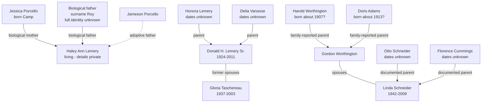

# Deep Research Report on the Haley, Lemery, Worthington, Schneider, Camp, Roy, and Porcello Lines

**Research date:** August 6, 2026  
**Repository edition:** Condensed from the completed deep-research report while preserving its findings, confidence assessments, privacy rules, and recommended next actions.

## Executive summary

This review produced four strong documentary advances, several defensible working hypotheses, and three major identity problems that cannot yet be solved responsibly from public records alone.

### Strong documentary advances

1. **Honora Lemery and Delia Vanasse → Donald H. Lemery Sr.**  
   Donald's Hartford Courant obituary states that he was born in Putnam, Connecticut, on September 12, 1924, and was the son of Honora and Delia (Vanasse) Lemery. It also identifies a surviving sister, Lorraine Lemieux, and notes that three other siblings predeceased him. This establishes Honora and Delia as Donald's parents with high confidence, but does not yet establish their own parents, dates, birthplaces, or marriage.

2. **Gloria Taschereau Lemery**  
   Gloria's obituary gives an exact birth date and place, March 15, 1937 in Springfield, Massachusetts, and an exact death date, November 15, 2003. It names siblings Donald Taschereau and Beverly Verizzi and children Mark, Cheryl, Michele, and predeceased son Donald Jr. Her Massachusetts birth certificate is now the decisive record needed to identify her parents.

3. **Otto Schneider and Florence Cummings → Linda and Frank Schneider**  
   Linda Worthington's obituary states that Linda was born in Stafford, Connecticut, on July 15, 1942, to Otto and Florence (Cummings) Schneider. Frank O. Schneider's obituary independently identifies the same parents, gives his birth as July 31, 1947 in Stafford Springs, and associates the family with Somers. These two independent obituaries provide high-confidence corroboration.

4. **Probable Harold and Doris Worthington household in 1940 Somers**  
   The 1940 Somers census index contains Harold Worthington, born about 1907; Doris, born about 1913; Harold F. Jr., born about 1930; Donald C., born about 1932; Marie, born about 1934; Charlotte, born about 1936; Gordon, born about 1937; and Joyce, born about 1939. The names and ages correspond closely to the known family, but the alphabetical index does not prove they occupied one household. The original census image is required before marking the household relationships confirmed.

### Identity problems still unresolved

- Haley's biological father is known only by the surname **Roy**.
- Jessica Porcello, born Camp, is reported as Haley's biological mother, but her full documentary identity and ancestry remain unverified.
- Jameson Porcello is reported as Haley's adoptive father, but his exact legal identity, marriage relationship, and adoption documentation remain unverified.

Broad people-search matches must not be used to attach unrelated living people to the tree. The correct route is Haley's original birth certificate, adoption-file information, Jessica's marriage record, and private DNA correlation if needed.

## Highest-priority actions

| Priority | Action | Expected result |
|---|---|---|
| Critical | Obtain Haley's original pre-adoption birth certificate and adoption-file information | Identify or substantially narrow the biological Roy father |
| Critical | Obtain the original 1940 census image for the probable Harold-Doris Worthington household in Somers | Confirm household composition, relationships, birthplaces, occupation, and residence |
| High | Order Gloria Taschereau's March 15, 1937 Springfield birth certificate | Identify both parents and their residences or birthplaces |
| High | Order Donald H. Lemery Sr.'s September 12, 1924 Putnam birth certificate | Obtain Honora and Delia's exact names, ages, residences, birthplaces, and occupations |
| High | Locate Honora Lemery and Delia Vanasse's marriage | Identify both sets of parents and resolve name variants |
| High | Obtain Linda Schneider's 1942 and Frank Schneider's 1947 Stafford birth records | Corroborate Otto and Florence and obtain their ages, birthplaces, and residence |
| High | Locate Harold Worthington and Doris Adams's marriage, probably circa 1927-1931 | Identify both sets of parents and verify Doris's maiden name |
| Medium | Locate Otto Schneider and Florence Cummings's marriage before July 1942 | Identify their parents and origins |
| Medium | Identify Jessica Camp's marriage to a Porcello and document Jameson's legal role | Separate biological, marital, and adoptive relationships |

## Evidence standards

The archive must distinguish among:

- **Documented facts** supported by original or official records
- **High-confidence derivative facts** supported by detailed obituaries or multiple independent sources
- **Family-reported facts** awaiting documentation
- **Index-level evidence** awaiting the original image
- **Research hypotheses** that must never be represented as proven

| Confidence | Meaning |
|---|---|
| Very high | Original or official record, or multiple independent records that agree |
| High | Detailed contemporary obituary or multiple consistent derivative sources |
| Moderate | Family testimony or strong index match lacking an original record |
| Low | Plausible hypothesis based on name, age, location, or family pattern |
| Unknown | Insufficient identifying information |

Original birth certificates, marriage records, adoption files, church registers, and census images supersede obituaries or indexes when conflicts appear.

## Privacy and restricted evidence

A private GitHub repository reduces exposure, but Git history is persistent. Raw adoption documents, unredacted certificates, current addresses, DNA exports, and private correspondence should remain outside ordinary Git history whenever practical.

| Sensitive item | Treatment |
|---|---|
| Full dates of birth for living people | Encrypted private research storage; year or `private` on cards |
| Original and amended birth certificates | Encrypted archive outside ordinary Git history |
| Adoption decree, agency correspondence, or court file | Restricted external storage with a redacted abstract in GitHub |
| Current addresses, phone numbers, and email addresses | Do not commit |
| DNA kit IDs and match names | Private coded DNA log |
| Medical or non-identifying adoption history | Private; summarize only genealogically necessary facts |
| Parentage allegations | Mark explicitly unproven until documentary or DNA confirmation |

## Working relationship model

The dotted relationship is adoptive. The Harold-Doris-to-Gordon connection remains family-reported pending original census and vital records.

# Haley's Camp, Roy, and Porcello lines

## Jessica Porcello, born Camp

### Current evidence

- Reported biological mother of Haley
- Reported birth surname: Camp
- Later surname: Porcello
- Family-reported birthday: August 27
- Approximate age in 2026: about 42, suggesting an estimated birth year of 1983 or 1984

The date and year remain private and unverified until a record is obtained.

### Missing evidence

- Full legal birth name
- Exact birth year and place
- Parents and siblings
- Marriage history
- Record explaining the Porcello surname
- Original record confirming the biological relationship to Haley

### Primary-source sequence

1. Haley's original birth certificate
2. Haley's amended post-adoption certificate
3. Adoption decree or agency-produced adoption summary
4. Jessica's marriage certificate or marriage-license application
5. Jessica's birth certificate after date and place are established
6. Parents' obituaries, censuses, cemetery records, probate, and military records

### Search strategy

Search Jessica Camp with a spouse surname of Porcello in Connecticut first, then Massachusetts, Rhode Island, New York, and New Jersey. Do not add guessed middle initials. Use marriage and residence records rather than public-directory profiles.

## Haley's biological father Roy

No defensible Roy pedigree can be built until a first name or another distinguishing identifier is obtained. Searching all plausible Roy men in Connecticut or nearby states would create a high risk of false identification.

### Records that may identify him

- Original birth certificate
- Adoption petition or decree
- Agency non-identifying report
- Parentage or support case
- Jessica's private papers or correspondence
- DNA matches and shared-match clustering

### DNA research sequence

1. Separate known Camp-side matches from paternal matches
2. Apply the Leeds method to second- through fourth-cousin-range matches
3. Build private descendant trees for each paternal cluster
4. Identify ancestral couples repeated across independent match trees
5. Test candidate relationships with shared-centimorgan ranges
6. Require age, geography, opportunity, and DNA inheritance to agree
7. Do not name a living candidate in the ordinary person card until confirmation and privacy decisions are complete

Search variants for older French-Canadian records may include Roy, LeRoy, Leroy, and Roi. `King` is only a possible historical translation and must never be assumed for a modern person.

## Jameson Porcello

Jameson belongs in the archive as Haley's adoptive father, while his ancestry remains separate from Haley's biological Roy line.

### Evidence still required

- Exact legal first and middle names
- Birth date and place
- Parents
- Marriage or partnership with Jessica
- Adoption date and jurisdiction
- Amended-certificate evidence

Search `Jameson` exactly before testing Jamison, James, an initial, or middle-name usage. A similar name is not sufficient unless spouse, child, location, and age agree.

# Lemery, Vanasse, and Taschereau lines

## Honora Lemery

### Supported fact

Honora is named with Delia Vanasse as a parent of Donald H. Lemery Sr. The parental relationship is high confidence.

### Unresolved

- Exact given name and spelling
- Sex as recorded in original documents
- Birth and death dates
- Birthplace and parents
- Marriage to Delia
- Immigration or French-Canadian origin

The documented form remains **Honora**. `Honoré` or `Honore` may be tested as search variants but must not replace the documented name without an original record.

### Best next records

- Donald's 1924 Putnam birth certificate
- Honora and Delia's civil marriage record
- St. Mary Church of the Visitation baptism and marriage records
- Original 1930, 1940, and 1950 censuses
- Death certificate, obituary, cemetery, and probate records

## Delia Vanasse Lemery

Donald's obituary presents Delia as `Delia (Vanasse) Lemery`, strongly supporting Vanasse as her maiden or prior surname.

### Search variants

- Delia / Délia Vanasse
- Adelia / Adélia Vanasse
- Odelia / Odélie Vanasse
- Delima Vanasse
- Vanass / Vanace / Vannasse

French-language variants must be corroborated through spouse, children, age, location, and migration. A Quebec name match alone is not proof.

### Decisive records

1. Donald's 1924 birth certificate
2. Civil marriage record
3. Catholic marriage entry
4. Original 1930-1950 censuses
5. Delia's death certificate and obituary
6. Siblings' records
7. Probate and cemetery records

## Gloria Taschereau Lemery

### High-confidence facts

- Born March 15, 1937 in Springfield, Massachusetts
- Died November 15, 2003 at Johnson Memorial Hospital in Stafford
- Lived in Enfield
- Former wife of Donald H. Lemery Sr.
- Siblings: Donald Taschereau and Beverly Verizzi
- Children named in obituary: Mark, Cheryl, Michele, and Donald Jr., who predeceased her

### Decisive next record

Order the Springfield birth certificate. It should identify Gloria's parents and allow the Taschereau line to be traced accurately.

# Worthington and Adams lines

## Probable 1940 Somers family cluster

| Person | Approximate birth year | Assessment |
|---|---:|---|
| Harold Worthington | 1907 | Strong candidate father |
| Doris Worthington | 1913 | Strong candidate mother |
| Harold F. Worthington Jr. | 1930 | Strong household candidate |
| Donald C. Worthington | 1932 | Strong household candidate |
| Marie Worthington | 1934 | Strong household candidate |
| Charlotte Worthington | 1935-1936 | Very strong correspondence |
| Gordon Worthington | 1937 | Very strong correspondence |
| Joyce Worthington | 1938-1939 | Very strong correspondence |

This is a probable household model, not completed proof. The original census page must establish dwelling, household, and line relationships.

## Harold Worthington

- Provisional birth year: about 1907, derived from the census index
- Probable marriage to Doris: about 1927-1931, inferred from the children's ages
- Full middle name and parents remain unknown

The marriage certificate, death certificate, obituary, Social Security application if available, and the 1910 and 1920 censuses should identify Harold's parents.

## Doris Adams Worthington

- Provisional birth year: about 1913, derived from the census index
- Adams is family-reported as her maiden name
- Maiden name must be verified by marriage or a child's birth record

The marriage-license application is likely the most valuable record because it may name both parents and provide residences, occupations, birthplaces, and prior marital status.

# Schneider and Cummings lines

## Documentary findings

Linda Worthington's obituary and Frank O. Schneider's obituary independently establish:

- Otto Schneider and Florence Cummings were parents of Linda Schneider
- Otto Schneider and Florence Cummings were parents of Frank O. Schneider
- Florence's maiden or prior surname was Cummings
- The family was associated with Stafford, Stafford Springs, and Somers
- Linda married Gordon Worthington
- The family later included Engelman step-relatives

The Engelman relationship must not yet be assigned to a particular remarriage. The sources establish a blended relationship but do not identify which parent remarried.

## Otto Schneider

No birth date, birthplace, parents, death date, or immigration status has been established.

### Best next records

- Linda and Frank's birth certificates
- Otto and Florence's marriage record
- Original 1940 and 1950 censuses
- Death certificate and obituary
- Naturalization or immigration records only if an immigrant origin is supported

Search Snyder, Snider, or Schneiter only as fuzzy variants and do not merge them without corroboration through Florence and the children.

## Florence Cummings Schneider

Florence's surname Cummings is consistently reported in both Linda's and Frank's obituaries.

### Search variants

- Florence Cummings
- Florence Cumming
- Florence Cummins
- Florence Schneider
- Florence C. Schneider
- Florence Engelman, only as an unproven later-marriage hypothesis

Do not add Engelman as an alternate name unless a marriage, obituary, or death certificate proves it.

# Record-acquisition matrix

| Target | First official record | Follow-on records |
|---|---|---|
| Jessica Camp | Haley's original birth certificate; Jessica's marriage record | Jessica's birth certificate, parents' obituaries and censuses |
| Roy father | Original birth certificate and adoption file | DNA clustering, parentage records, then vital and census records |
| Jameson Porcello | Adoption decree and amended certificate | Marriage, birth, parents' obituaries, immigration and military records |
| Honora Lemery | Donald's 1924 birth certificate | Marriage to Delia, church records, 1930-1950 censuses |
| Delia Vanasse | Marriage record and Donald's birth certificate | Birth, immigration, Quebec records only if supported by birthplace evidence |
| Gloria Taschereau | March 15, 1937 birth certificate | 1940 census, parents' marriage, siblings' records |
| Harold Worthington | Original 1940 census and marriage record | 1910/1920 censuses, death certificate, obituary |
| Doris Adams | Marriage record and children's birth records | 1920 census with parents, death record, obituary |
| Otto Schneider | Children's birth records and marriage | 1940/1950 censuses, death, naturalization if applicable |
| Florence Cummings | Marriage record and children's birth records | Earlier census, parents' records, blended-family documentation |

# Prioritized research waves

## Wave 1: identity bridges

- Obtain Haley's original birth certificate
- Obtain adoption-file information
- Locate Jessica's marriage record
- Identify Jameson's legal adoption role

## Wave 2: exact certificates already locatable

- Donald H. Lemery Sr., September 12, 1924, Putnam
- Gloria Taschereau, March 15, 1937, Springfield
- Linda Schneider, July 15, 1942, Stafford
- Frank O. Schneider, July 31, 1947, Stafford Springs

## Wave 3: original census images

- Retrieve the original 1940 Somers Worthington household image
- Find the family in 1950, then work backward through 1930, 1920, and 1910
- Search Honora and Delia in 1950, 1940, and 1930 using known children
- Search Otto and Florence in 1950 using Linda and Frank, then in 1940

## Wave 4: marriages

- Honora/Honore Lemery and Delia/Adelia Vanasse, approximately 1915-1924
- Harold Worthington and Doris Adams, approximately 1927-1931
- Otto Schneider and Florence Cummings, before July 1942
- Donald H. Lemery and Gloria Taschereau, broadly mid-1950s to early 1960s
- Jessica Camp and a Porcello, private range around Haley's childhood

## Wave 5: collateral relatives

- Lorraine Lemieux and Robert Lemery for Honora and Delia
- Donald Taschereau and Beverly Verizzi for Gloria
- Harold F. Jr., Donald C., Marie, Charlotte, Gordon, and Joyce for Harold and Doris
- Frank, Norma, Kenneth, Timothy, May, Jim Engelman, and Mark Engelman for Otto and Florence

# GitHub research backlog

## Critical

- [ ] Obtain Haley's original pre-adoption birth certificate
- [ ] Request Haley's adoption-file information and non-identifying history
- [ ] Identify Haley's biological father Roy from documentary evidence
- [ ] Build private Roy DNA shared-match clusters

## High

- [ ] Locate Jessica Camp's Porcello marriage record
- [ ] Verify Jameson Porcello's exact legal identity and adoption role
- [ ] Order Donald H. Lemery Sr.'s 1924 Putnam birth certificate
- [ ] Locate Honora Lemery and Delia Vanasse's civil and church marriage
- [ ] Search St. Mary Putnam baptism and marriage compilations
- [ ] Order Gloria Taschereau's 1937 Springfield birth certificate
- [ ] Retrieve original 1940 Somers Worthington census image
- [ ] Locate Harold Worthington and Doris Adams's marriage record
- [ ] Order Linda and Frank Schneider birth certificates
- [ ] Locate Otto Schneider and Florence Cummings's marriage
- [ ] Retrieve Otto and Florence's 1940 and 1950 census households

## Medium

- [ ] Trace Harold Worthington in the 1910 and 1920 censuses
- [ ] Trace Doris Adams in the 1920 census
- [ ] Resolve the Schneider-Engelman stepfamily connection
- [ ] Locate cemetery and death records for Honora, Delia, Harold, Doris, Otto, and Florence
- [ ] Create source-citation and negative-search logs for all ten targets

# Current conclusions for person cards

- **Jessica Porcello, biological father Roy, and Jameson Porcello:** open-ended private identities requiring original records before further ancestry is assigned.
- **Honora Lemery and Delia Vanasse:** documented as Donald H. Lemery Sr.'s parents, but their earlier ancestry remains untraced.
- **Gloria Taschereau:** vital facts are high confidence and her birth certificate is ready to be ordered.
- **Harold Worthington and Doris Adams:** very strong 1940 Somers candidate family pending the original census image.
- **Otto Schneider and Florence Cummings:** high-confidence parents of Linda and Frank, with their own ancestry unresolved.

## Source note

The complete deep-research artifact remains in the ChatGPT file library under the title **Deep Research Report on the Haley, Lemery, Worthington, Schneider, Camp, Roy, and Porcello Lines**. This repository edition preserves its central findings and action plan. Original certificates and census images were not located during the research and must not be represented as obtained until added to the evidence archive.